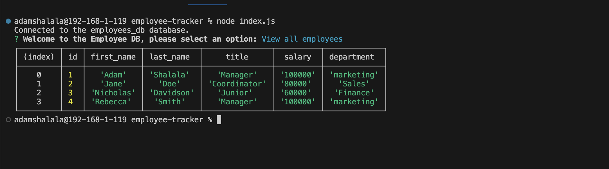

# Employee Tracker

## Link to Video Demo

https://drive.google.com/file/d/1aAB9ODkxPfdjtkAkDb34mwUH2yoi71vy/view

## Description

- A simple CLI app to keep track of employees, departments and roles across your organisation.

### Why
- This project was built to further my understanding of mysql and the node package mysql2
### Problem this app solves
- The tracking of employess in an organissation
### Learnings
- I learnt how to manipulate and display mysql db table in the command line using inquirer and mysql2

## Table of contents:

- [Installation](#installation)
- [Usage](#usage)
- [Contributing](#contributing)
- [Tests](#tests)
- [License](#license)
- [Questions](#questions)

## Installation

- Code editor (e.g. Visual Studio Code) Modern web browser (e.g. Google Chrome, Mozilla Firefox)

## Usage

Open in your code editor and install all the necessary packages before running. Once the packages are installed, run mysql and run the the sql files int he db folder to setup and seed the db.

### Screenshot 

## Contributing

### To contribute to our project, please follow these steps:

- Fork the repository and create a new branch for your changes.
- Make your changes and commit them to your branch.
- Push your changes to your forked repository.
- Submit a pull request to our repository.
- Please provide a clear and descriptive title for your pull request, along with a detailed description of the changes you have made. We also ask that you include any relevant tests or documentation updates with your changes.

## Tests

undefined

## License

This project is licensed under the mit license.

## Questions

If you have any questions or feedback on the project, feel free to reach out to me at:

- Email: ashalala93@gmail.com
- GitHub: https://github.com/supershalala

